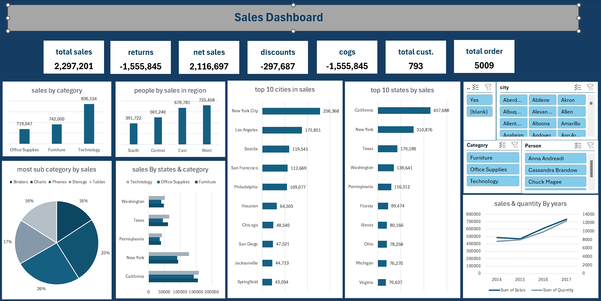

# shipping-Analysis-dashboard
# 📦 Shipping Company Sales Dashboard

An interactive Excel dashboard analyzing a shipping company's **sales performance**.  
The goal of this project is to provide insights into **sales, returns, shipping costs, discounts, and customer behavior** across multiple regions and product categories.

---

## 🎯 Project Objectives
- Monitor **total completed sales** and **net revenue**  
- Track **returns** and identify high-return products  
- Analyze **shipping costs** and **discounts** on completed shipments  
- Count **customers** and **orders**  
- Compare **product categories**, **sub-categories**, and regions  
- Identify top-performing **cities and states**  
- Analyze sales trends over time

---

## 🗂 Dataset
The dataset has been cleaned and transformed to ensure accurate analysis:
- **Ship Date** formatted and corrected  
- Removed duplicate values like repeated "USA" in location  
- Corrected inconsistent numbers  
- Cleaned dataset used for the dashboard is included  

Files:
- `shipping_data_raw.xlsx` → Original uncleaned dataset  
- `shipping_dashboard.xlsx` → Cleaned data + interactive dashboard  

---

## 📊 Dashboard KPIs & Metrics
- **Total Completed Sales**  
- **Number of Returns**  
- **Sales of Completed Shipments**  
- **Total Discounts on Completed Shipments**  
- **Shipping Cost of Completed Shipments**  
- **Number of Customers**  
- **Number of Orders**  

---

## 🔍 Additional Analyses
- Sales by **Product Category** and **Sub-Category**  
- Top **Sub-Category** in sales  
- Sales distribution by **Region**, **State**, and **Category**  
- Top 10 **Cities** in sales  
- Top 10 **States** in sales  
- Yearly sales analysis by **Quantity**

---

## 🎛 Interactivity
The dashboard contains **4 slicers** for dynamic filtering:
1. Completed / Not Completed Sales  
2. Cities  
3. Product Categories  
4. Customers

---

## 🧠 Skills Demonstrated
- Excel **PivotTables** & **PivotCharts**  
- **Power Pivot** for data modeling  
- **Slicers & Filters** for interactivity  
- **Data Cleaning** (dates, duplicates, inconsistent numbers)  
- **KPIs creation** and performance monitoring  
- Visualizations: **Bar, Line, Pie Charts**

---

## 🖼️ Dashboard Preview

---

## 💡 Notes
This dashboard focuses on the **sales and shipping analysis** as requested by the client.  
Additional experimental analysis (like currency breakdown) was excluded to keep the dashboard focused and clean.
